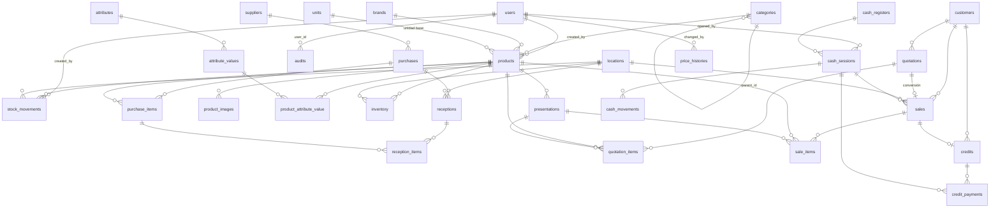

# Modelo de Base de Datos — ERP "Construir a tu Alcance"

> Diseño de base de datos normalizado (**3FN mínimo**) para Laravel 12 / MySQL 8.
> Este documento describe el diagrama ER, cada tabla, cada relación y la justificación técnica.
> Las migraciones están en `database/migrations/` y aplican limpio con `php artisan migrate:fresh`.

---

## 1. Diagrama ER (Mermaid)

> Se puede visualizar en cualquier visor Mermaid (GitHub lo renderiza).

> `stock_movements`, `cash_movements`, `price_histories` y `audits` usan relaciones **polimórficas** (`reference` / `priceable` / `auditable`) que Mermaid no dibuja como FK duras; se explican en §3.

**Leyenda de cardinalidad:** `||--o{` uno-a-muchos; `||--o|` uno-a-uno/cero.

---

## 2. Explicación de cada tabla

### Seguridad y acceso
| Tabla | Propósito |
|---|---|
| `users` | Usuarios del sistema. Con `softDeletes` para conservar historial de acciones aunque se dé de baja. |
| `roles`, `permissions`, `model_has_roles`, `model_has_permissions`, `role_has_permissions` | RBAC de **Spatie Permission**. Roles: Administrador, Gerente, Vendedor, Almacenero, Cajero. Permisos granulares (`prices.update`, `cash.close`…). |
| `settings` | Configuración clave-valor (moneda, impuesto, margen sugerido, datos de empresa, series de documentos). Evita hardcode. |

### Catálogo de productos
| Tabla | Propósito |
|---|---|
| `units` | Unidad base de medida (und, m, kg). `abbreviation` única. |
| `brands` | Marcas. `name` único. |
| `categories` | Categorías **jerárquicas** (`parent_id` autoreferencial). `slug` único. |
| `attributes` | Atributos dinámicos (Color, Medida, Material). |
| `attribute_values` | Valores posibles de cada atributo. Único `(attribute_id, value)`. |
| `products` | Producto. `uuid` (URLs/QR/API), `code` autogenerado único, `barcode` opcional único, `cost` (costo promedio ponderado), `min_stock` para alertas. `softDeletes`. |
| `presentations` | Presentaciones de venta del producto: `equivalence` (unidades base por presentación), `price_without_invoice`, `price_with_invoice`, `sort_order`. Sin código de barras (por requerimiento). |
| `product_attribute_value` | Pivot producto ↔ valor de atributo. Único por par. |
| `product_images` | Varias imágenes por producto (`is_primary`, `sort_order`, `disk`). Storage. |

### Inventario y Kardex
| Tabla | Propósito |
|---|---|
| `locations` | Ubicaciones físicas (Patio, Muestrario, Depósito). `is_default`. |
| `inventory` | **Saldo cacheado** por `(product_id, location_id)` — único. `quantity` y `reserved_quantity`. Se escribe solo desde `InventoryService`. |
| `stock_movements` | **Kardex append-only** (fuente de verdad). `type`, `direction`, `quantity` (base), `unit_cost`, `balance_after`, morph `reference` al documento origen. Sin softDeletes (inmutable). Índice `(product_id, location_id, created_at)`. |

### Abastecimiento
| Tabla | Propósito |
|---|---|
| `suppliers` | Proveedores. `document_number` único opcional. `softDeletes`. |
| `purchases` | Compra (documento comercial). `status` (pending/partial/completed/cancelled), `payment_type` (cash/credit). **NO mueve stock.** |
| `purchase_items` | Detalle de compra. `quantity_ordered`, `quantity_received` (acumulado), `unit_cost`. |
| `receptions` | Recepción física de mercadería (una compra → varias recepciones). **Mueve stock.** Entra a una `location_id`. |
| `reception_items` | Detalle de recepción, ligado al `purchase_item` correspondiente. Genera los `stock_movements` IN. |

### Comercial
| Tabla | Propósito |
|---|---|
| `customers` | Clientes. `type` (registered/occasional), `credit_limit`. Ocasionales: solo `name`. `softDeletes`. |
| `quotations` | Cotizaciones. `with_invoice`, `status` (open/converted/expired/cancelled), `valid_until`. |
| `quotation_items` | Detalle de cotización (producto + presentación + precio congelado). |
| `sales` | Venta. `uuid` (QR), `with_invoice`, `payment_type` (cash/credit/mixed), `status`, `location_id` (de dónde sale el stock), `cash_session_id`, `quotation_id` (si vino de cotización). |
| `sale_items` | Detalle de venta. `quantity` (en presentación), `base_quantity` (convertida a unidad base, congelada), `unit_price`, `price_pending`. |

### Créditos y cobros
| Tabla | Propósito |
|---|---|
| `credits` | Cuenta corriente por venta (1:1 con `sales`). `original_amount`, `paid_amount`, `balance`, `status` (open/partial/paid/overdue), `due_date`. |
| `credit_payments` | Cobros parciales. `amount`, `method` (cash/qr/transfer), `cash_session_id` si entra por caja, `paid_at`. |

### Finanzas
| Tabla | Propósito |
|---|---|
| `cash_registers` | Caja(s). Una sola por requerimiento; tabla lista para más. |
| `cash_sessions` | Sesión de caja: apertura/cierre/arqueo (`opening_amount`, `closing_amount`, `counted_amount`, `difference`), `status`. |
| `cash_movements` | Movimientos de caja: `type` (income/expense/sale/credit_payment), `method`, morph `reference` (venta/cobro). |

### Transversal
| Tabla | Propósito |
|---|---|
| `price_histories` | Historial **append-only** de precios/costos. Morph `priceable` (presentation/product), `field`, `old_value`, `new_value`, `changed_by`. Nunca se sobrescribe. |
| `audits` | Auditoría: `user_id`, `event`, morph `auditable`, `old_values`/`new_values` (json), `ip_address`, `user_agent`, `url`, `created_at`. |
| `jobs`, `failed_jobs`, `cache` | Infraestructura Laravel (Queue preparada, cache). |

---

## 3. Explicación de cada relación

**Catálogo**
- `categories.parent_id → categories.id` (`nullOnDelete`): jerarquía; borrar un padre deja huérfanos como raíz, no rompe.
- `products.category_id/brand_id/unit_id` (`restrictOnDelete`): no se puede borrar una categoría/marca/unidad con productos → integridad.
- `presentations.product_id` (`cascadeOnDelete`): las presentaciones son parte del producto; si el producto se elimina físicamente, se van con él.
- `product_attribute_value`: pivot M:N producto ↔ attribute_value; único por par (evita duplicados = 3FN).
- `attribute_values.attribute_id` (`restrictOnDelete`): no borrar un atributo con valores en uso.

**Inventario**
- `inventory (product_id, location_id)` único + `restrictOnDelete`: un solo saldo por par; no se borra producto/ubicación con existencias.
- `stock_movements.product_id/location_id` (`restrictOnDelete`): el Kardex nunca queda huérfano.
- `stock_movements.reference` (**morph**, nullable): apunta al documento que originó el movimiento (recepción, venta, transferencia, ajuste). Una sola columna polimórfica en vez de N FKs → limpio y extensible.

**Abastecimiento**
- `purchases.supplier_id` (`restrictOnDelete`): no borrar proveedor con compras.
- `purchase_items.purchase_id` (`cascadeOnDelete`) / `product_id` (`restrictOnDelete`): el detalle pertenece a su cabecera; el producto no se borra si está en compras.
- `receptions.purchase_id/location_id` (`restrictOnDelete`): recepción siempre trazable a su compra y ubicación.
- `reception_items.reception_id` (`cascadeOnDelete`), `purchase_item_id/product_id` (`restrictOnDelete`): enlaza lo recibido con lo ordenado para recalcular `purchases.status`.

**Comercial**
- `quotations.customer_id` / `sales.customer_id` (`nullOnDelete`): cliente ocasional puede ser nulo; si se borra un cliente registrado, el documento se conserva.
- `sales.quotation_id` (`nullOnDelete`): traza la conversión cotización→venta sin obligarla.
- `sales.location_id` (`restrictOnDelete`): de qué ubicación salió el stock.
- `sales.cash_session_id` (`nullOnDelete`): venta contado ligada a la sesión de caja.
- `sale_items`/`quotation_items` (`cascadeOnDelete` a su cabecera; `restrictOnDelete` a product): detalle inseparable de su documento; precios y `base_quantity` congelados.

**Créditos / Caja**
- `credits.sale_id` **único** + `restrictOnDelete`: 1:1 con venta; no se borra una venta con crédito.
- `credit_payments.credit_id` (`cascadeOnDelete`), `cash_session_id` (`nullOnDelete`).
- `cash_sessions.cash_register_id` (`restrictOnDelete`), `opened_by` (`restrictOnDelete`), `closed_by` (`nullOnDelete`).
- `cash_movements.cash_session_id` (`cascadeOnDelete`), `reference` (**morph**): venta o cobro que lo generó.

**Transversal**
- `price_histories.priceable` (**morph**), `changed_by` (`nullOnDelete`): quién cambió qué precio y sobre qué entidad.
- `audits.auditable` (**morph**), `user_id` (`nullOnDelete`): qué entidad y qué usuario.

---

## 4. Justificación técnica de las decisiones

1. **Normalización 3FN**: cada atributo depende solo de la PK; sin grupos repetidos (imágenes, presentaciones, atributos → tablas propias); sin dependencias transitivas (marca/categoría/unidad en tablas separadas, no como texto en `products`). Los pivots con unique compuesto evitan redundancia.

2. **PK autoincremental (`bigIncrements`) + UUID selectivo**: `bigint` como PK por rendimiento de índices/joins en MySQL; `uuid` solo en `products`, `sales` y `audits` (exposición externa/QR/API, valor no adivinable). UUID en todo penaliza sin aportar.

3. **`decimal` en vez de `float`**: importes `decimal(14,2)`, costos/cantidades/equivalencias `decimal(14,4)`. Evita errores de redondeo en dinero y permite fracciones (metros, kilos) en ferretería.

4. **Reglas de borrado deliberadas**:
   - `cascadeOnDelete` solo en **detalles hijos** (items) respecto de su cabecera.
   - `restrictOnDelete` en catálogos y documentos referenciados (protege integridad histórica).
   - `nullOnDelete` en columnas de **actor** (`created_by`, `changed_by`, `user_id`) y en relaciones opcionales (cliente ocasional, cotización origen).
   - `cascadeOnUpdate` uniforme para propagar cambios de PK (raro, pero consistente).

5. **`softDeletes` solo en catálogos** (`users`, `products`, `categories`, `brands`, `units`, `customers`, `suppliers`): permite "dar de baja" sin romper históricos. **NO** en documentos ni en `stock_movements`/`price_histories`/`audits`: son **inmutables/append-only** por auditoría — se anulan con estado, no se borran.

6. **Estados como `string` + Enums PHP** (`app/Domain/Enums`): type-safety en la app, legibilidad en BD, sin tablas de catálogo triviales, e índice en columnas de estado para filtros rápidos.

7. **Relaciones polimórficas** (`reference`, `priceable`, `auditable`): un movimiento/precio/auditoría puede originarse en distintos tipos de documento; el morph evita multiplicar FKs y mantiene el esquema extensible (3FN respetada, sin columnas nulas por tipo).

8. **Stock: saldo cacheado + Kardex**: `inventory` da lecturas O(1) para venta/consulta; `stock_movements` es la verdad auditable y reconstruible (`inventory:rebuild`). `balance_after` permite Kardex con saldo corriente sin recomputar.

9. **Compra ≠ Recepción**: separar el documento comercial del hecho físico modela la realidad (mercadería que llega en partes) y permite estados parcial/completa recalculando `quantity_received` vs `quantity_ordered`.

10. **Precios congelados en documentos** + historial append-only: los `*_items` guardan `unit_price` (y `base_quantity`) del momento; cambiar un precio no altera ventas pasadas → reportes consistentes.

11. **Índices**: en `barcode`, `code`, `document_number`, columnas de `status`/`type`, y `created_at` (+ compuesto en Kardex) para las búsquedas y reportes más frecuentes.

12. **Charset `utf8mb4_unicode_ci`**: soporte completo Unicode (nombres, símbolos).

---

## 5. Verificación

- `php artisan migrate:fresh` aplica las 14 migraciones sin error contra MySQL 8.
- `vendor/bin/pint --test` pasa (PSR-12).
- Sin controladores, vistas ni modelos de negocio: **solo arquitectura de base de datos**, como se solicitó.
